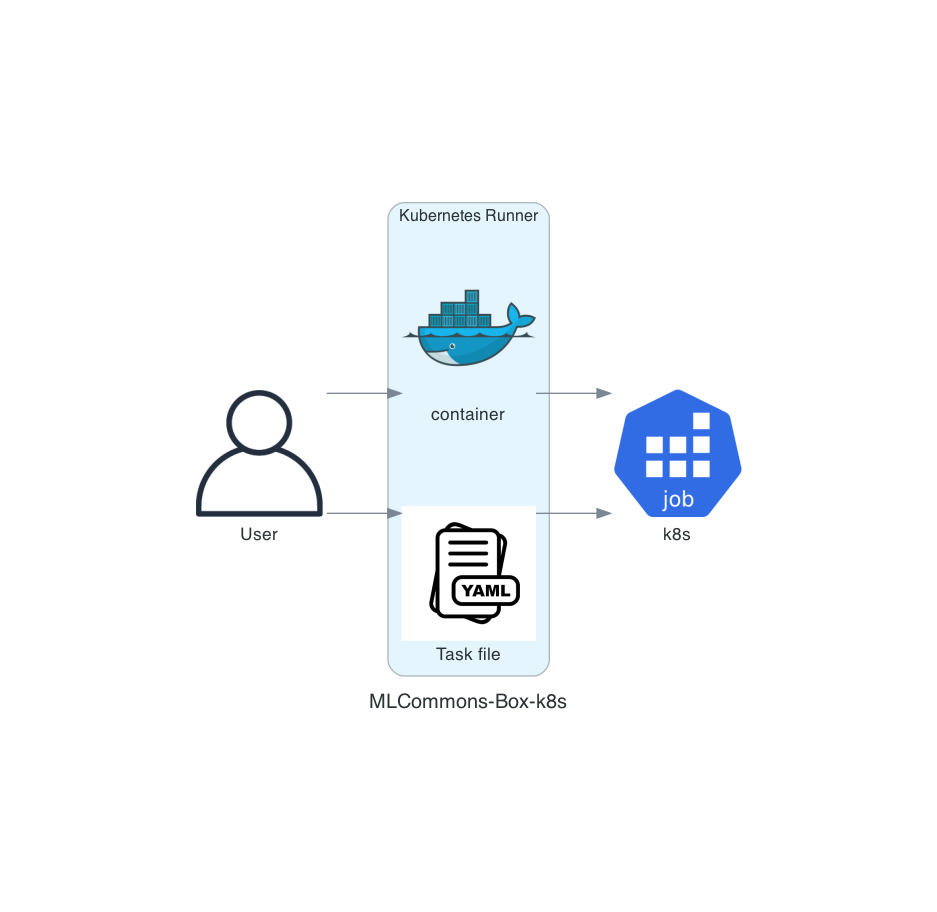

# Kubernetes Runner

The Kubernetes Runner runs a MLCommons-Box on a Kubernetes cluster.

[Skip over to the fun part.](#prepare-a-kubernetes-cluster)

## Why Kubernetes?

One of the key goals of the MLCommons-Box project is to enable portability of ML models.
Kubernetes offers the a good set of abstractions to enable model training to be portable
across different compute platforms.

## Design

[Kubernetes Runner Proposal Doc](http://bit.ly/cube-k8s-runner)

The Kubernetes runner takes in a kubernetes specific task file in the `run` directory and re-uses the Docker runner
platform config and prepares a Kubernetes Job manifest. The runner then creates the job on the Kubernetes cluster.




The Kubernetes Runner takes in a MLCube run configuration file similar to other runners. With clear definitions of input
and output bindings.
Here's an example:

```yaml
schema_type: mlcube_invoke
schema_version: 1.0.0

task_name: kubernetes   # task name set to 'kubernetes'

input_binding:  # input parameters (name: value)
  data_dir:
    path: workspace/data
    k8s:
      pvc: mlcube-input
...
output_binding: # output parameters (name: value)
  model_dir:
    path: workspace/model
    k8s:
      pvc: mlcube-output
...
```

The Runner also re-uses the Docker platform config file. So it needs a Docker platform config file in the Box. Let's
revisit the Docker platform config.

```yaml
schema_type: mlcube_platform
schema_version: 0.1.0

platform:
  name: "docker"
  version: ">=18.01"
container:
  image: "mlperf/mlcube:mnist"
```

With these two config files, the runner then constructs the following Kubernetes Job manifest. 

```yaml
apiVersion: batch/v1
kind: Job
metadata:
  namespace: default
  generateName: mlcube-mnist-
spec:
  template:
    spec:
      containers:
      - name: mlcube-container
        image: mlperf/mlcube:mnist
        args:
        - --data_dir=/mnt/mlcube/mlcube-input/workspace/data
        - --model_dir=/mnt/mlcube/mlcube-output/workspace/model
        volumeMounts:
        - name: mlcube-input
          mountPath: /mnt/mlcube/mlcube-input
        - name: mlcube-output
          mountPath: /mnt/mlcube/mlcube-output
      volumes:
      - name: mlcube-input
        persistentVolumeClaim:
          claimName: mlcube-input
      - name: mlcube-output
        persistentVolumeClaim:
          claimName: mlcube-output
      restartPolicy: Never
  backoffLimit: 4
```

## Configure a Box for the runner

Prerequisites:

- A Kubernetes cluster
- `KUBECONFIG` for the cluster
- pre-created volumes for the Box

### Create a Task file

Based on the setup, create a specific task file for the Box.

#### Create a YAML file in the `run` directory

```bash
touch run/kubernetes.yaml
```

#### Set Schema for Task

```yaml
schema_type: mlcube_invoke
schema_version: 1.0.0
```

#### Set task name

```yaml
task_name: kubernetes
```

#### Set input and output bindings

```yaml
input_binding:  # input parameters (name: value)
  data_dir:
    path: workspace/data
    k8s:
      pvc: mlcube-input

output_binding: # output parameters (name: value)
  model_dir:
    path: workspace/model
    k8s:
      pvc: mlcube-output
```

## Run a cube with the CLI

```bash
pip install mlcube-k8s
mlcube_k8s run \
  --mlcube=examples/mnist \
  --platform=examples/mnist/platforms/docker.yaml \
  --task=examples/mnist/run/kubernetes.yaml  \
  --loglevel INFO
```
